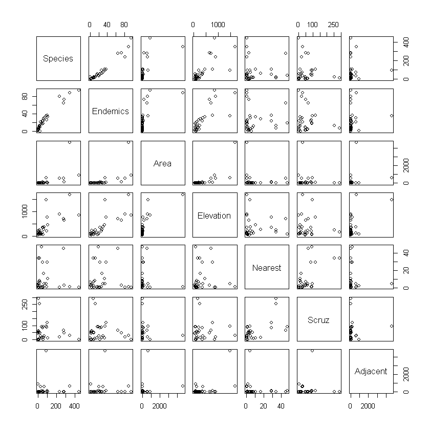
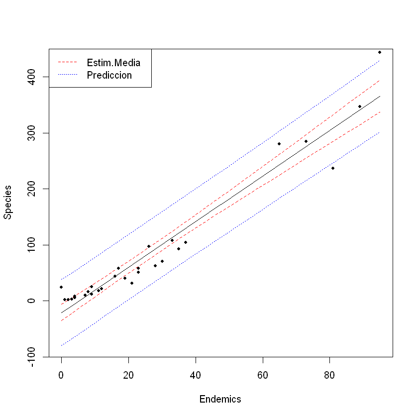
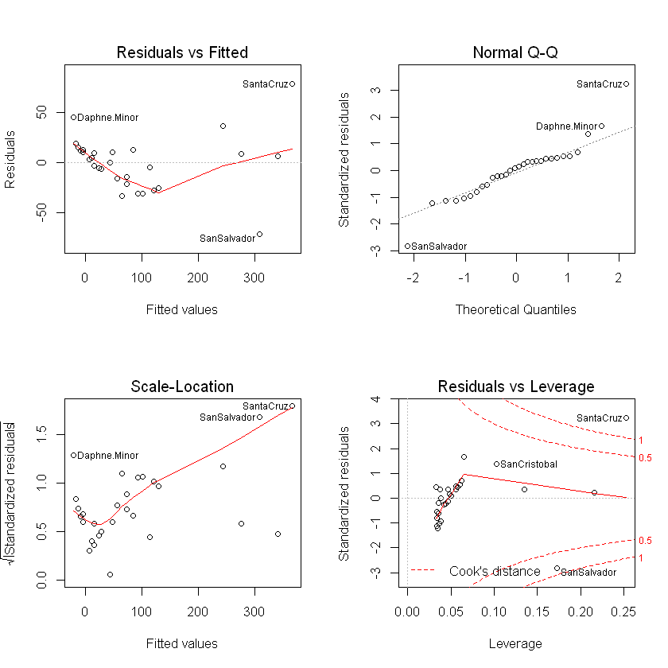
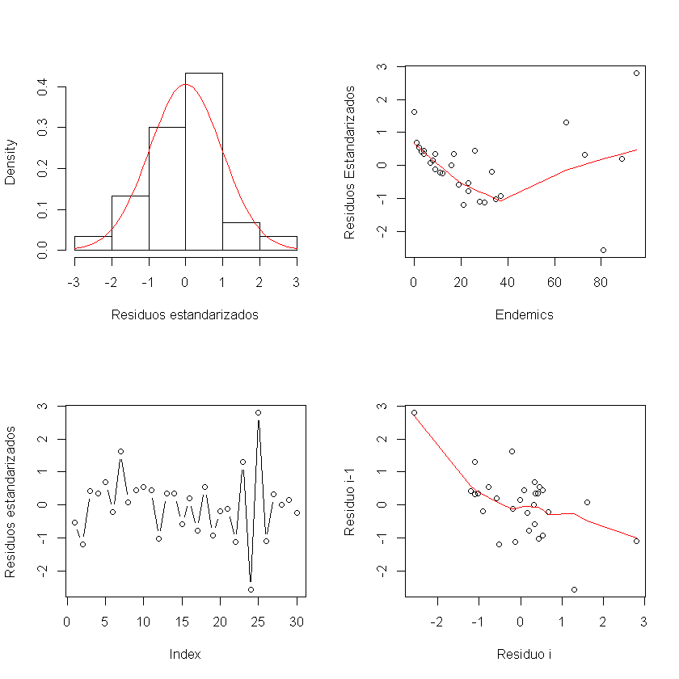
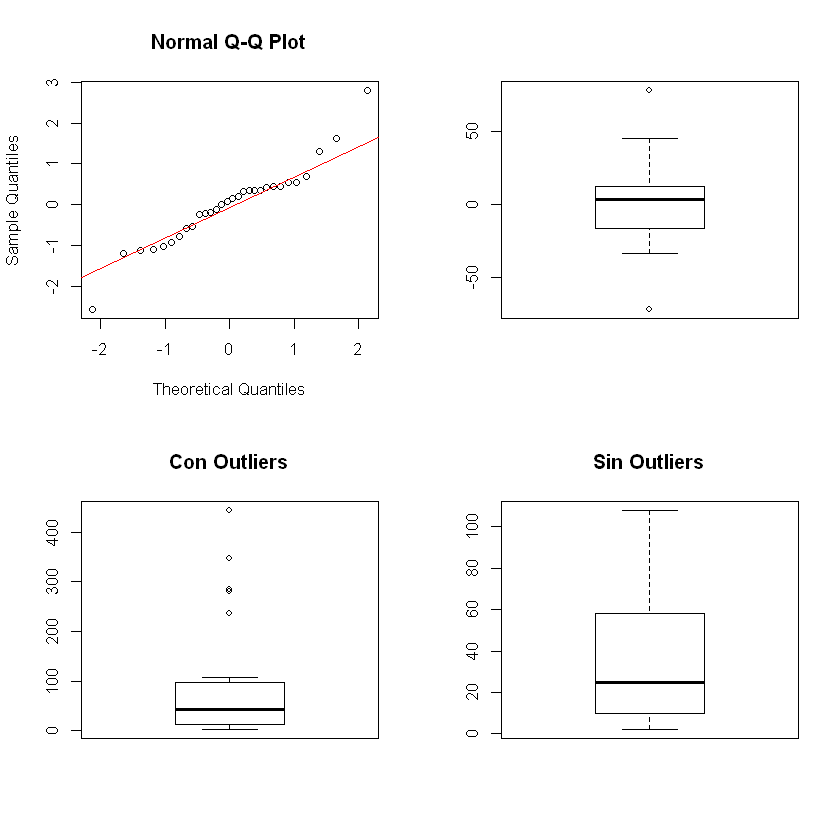
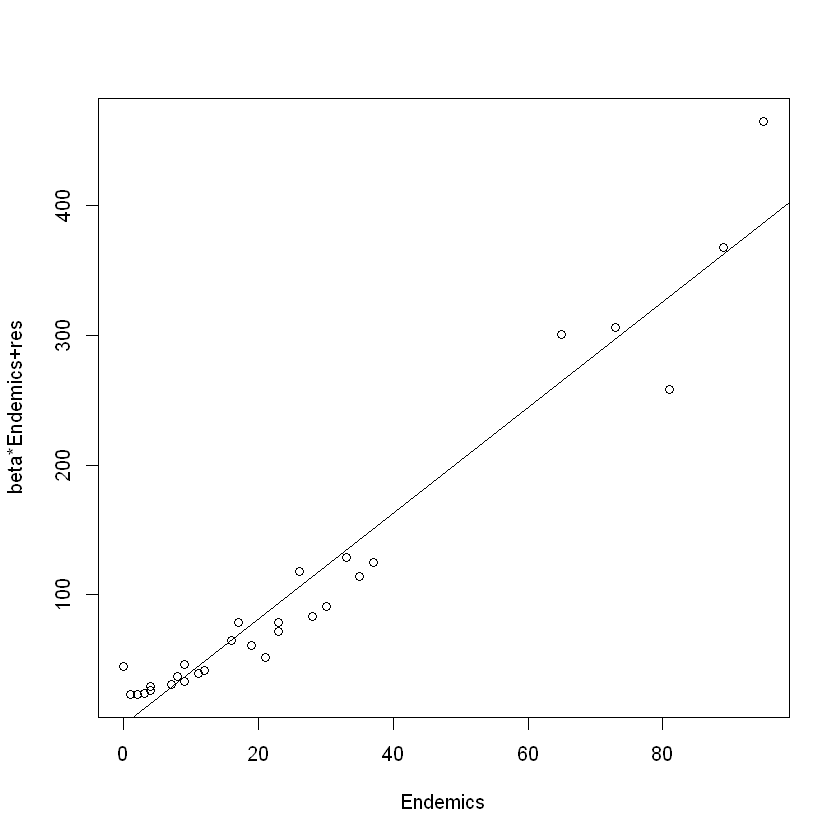
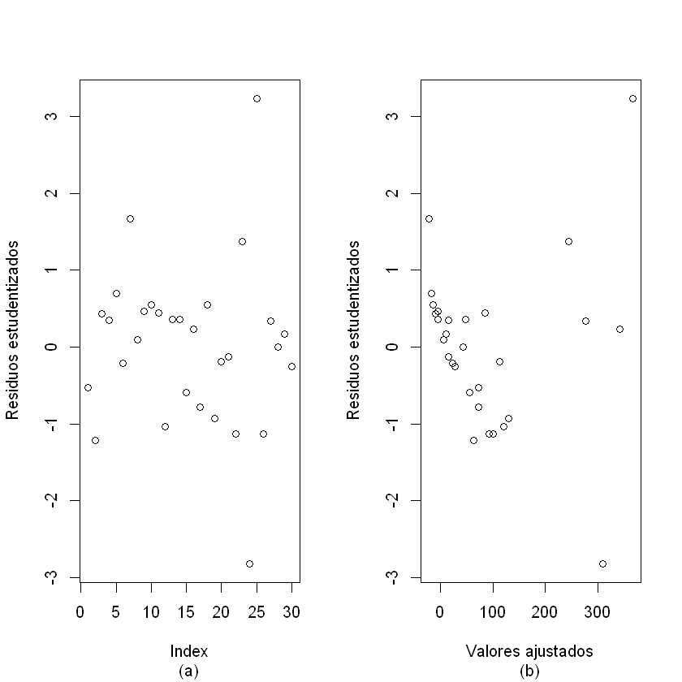
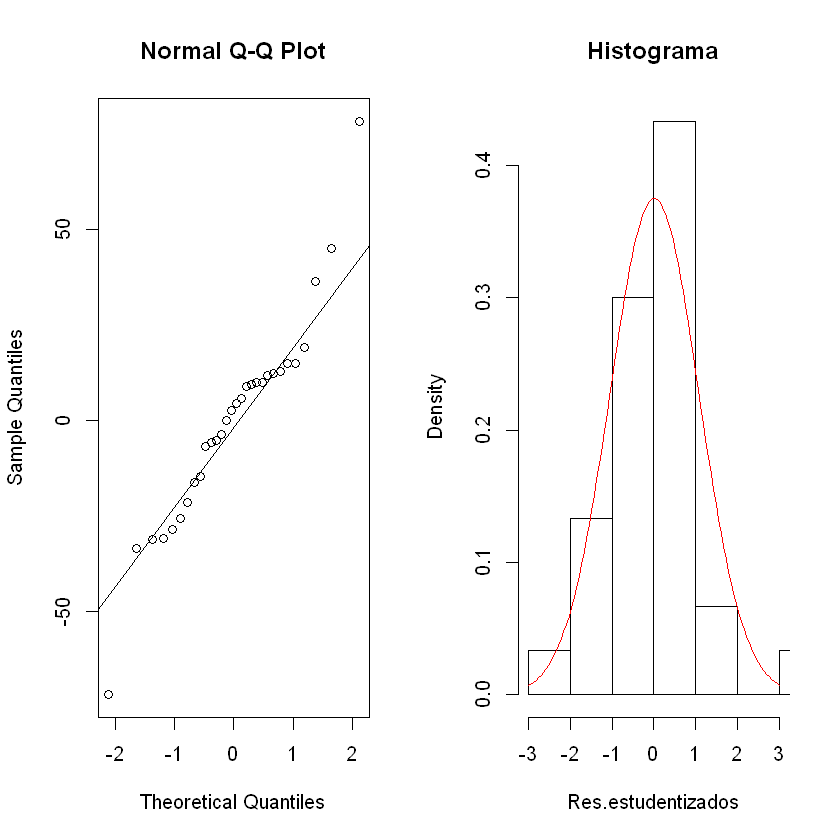

# Modelos Lineales

De manera general, es posible representar el modelo lineal de la forma

$$
y_{i}|x_{i} \overset{iid}{\sim} N \left( x_{i}^{\prime} \beta , \sigma^{2} \right), \; i = 1, \dots, n
$$

con $x_{i}^{\prime} = \left( 1,x_{1i}, \dots , x_{i,p-1} \right)$

En ese orden de ideas, se observa que las covariables pueden presentar diferentes características; pueden ser continuas o categóricas. Según eso, la interpretación del modelo varía. En el primer caso, cuando se tiene variables de tipo continuo, el objetivo de los modelos es, generalmente, predictivo. En el caso de las variables categóricas se tratan objetivos  de comparación de grupos.

El ejemplo de las _Islas Galápagos_ sirve para ilustrar el primer caso:


```R
library(faraway)
data(gala)
head(gala)
```


<table>
<thead><tr><th></th><th scope=col>Species</th><th scope=col>Endemics</th><th scope=col>Area</th><th scope=col>Elevation</th><th scope=col>Nearest</th><th scope=col>Scruz</th><th scope=col>Adjacent</th></tr></thead>
<tbody>
	<tr><th scope=row>Baltra</th><td>58    </td><td>23    </td><td>25.09 </td><td>346   </td><td>0.6   </td><td> 0.6  </td><td>  1.84</td></tr>
	<tr><th scope=row>Bartolome</th><td>31    </td><td>21    </td><td> 1.24 </td><td>109   </td><td>0.6   </td><td>26.3  </td><td>572.33</td></tr>
	<tr><th scope=row>Caldwell</th><td> 3    </td><td> 3    </td><td> 0.21 </td><td>114   </td><td>2.8   </td><td>58.7  </td><td>  0.78</td></tr>
	<tr><th scope=row>Champion</th><td>25    </td><td> 9    </td><td> 0.10 </td><td> 46   </td><td>1.9   </td><td>47.4  </td><td>  0.18</td></tr>
	<tr><th scope=row>Coamano</th><td> 2    </td><td> 1    </td><td> 0.05 </td><td> 77   </td><td>1.9   </td><td> 1.9  </td><td>903.82</td></tr>
	<tr><th scope=row>Daphne.Major</th><td>18    </td><td>11    </td><td> 0.34 </td><td>119   </td><td>8.0   </td><td> 8.0  </td><td>  1.84</td></tr>
</tbody>
</table>


Parte del proceso exploratorio consiste en analizar gráficamente las variables, además de otras pruebas que pueden implementarse:


```R
summary(gala)
```


        Species          Endemics          Area            Elevation      
     Min.   :  2.00   Min.   : 0.00   Min.   :   0.010   Min.   :  25.00  
     1st Qu.: 13.00   1st Qu.: 7.25   1st Qu.:   0.258   1st Qu.:  97.75  
     Median : 42.00   Median :18.00   Median :   2.590   Median : 192.00  
     Mean   : 85.23   Mean   :26.10   Mean   : 261.709   Mean   : 368.03  
     3rd Qu.: 96.00   3rd Qu.:32.25   3rd Qu.:  59.237   3rd Qu.: 435.25  
     Max.   :444.00   Max.   :95.00   Max.   :4669.320   Max.   :1707.00  
        Nearest          Scruz           Adjacent      
     Min.   : 0.20   Min.   :  0.00   Min.   :   0.03  
     1st Qu.: 0.80   1st Qu.: 11.03   1st Qu.:   0.52  
     Median : 3.05   Median : 46.65   Median :   2.59  
     Mean   :10.06   Mean   : 56.98   Mean   : 261.10  
     3rd Qu.:10.03   3rd Qu.: 81.08   3rd Qu.:  59.24  
     Max.   :47.40   Max.   :290.20   Max.   :4669.32  


```R
round(cor(gala),4)
```


<table>
<thead><tr><th></th><th scope=col>Species</th><th scope=col>Endemics</th><th scope=col>Area</th><th scope=col>Elevation</th><th scope=col>Nearest</th><th scope=col>Scruz</th><th scope=col>Adjacent</th></tr></thead>
<tbody>
	<tr><th scope=row>Species</th><td> 1.0000</td><td> 0.9709</td><td> 0.6178</td><td> 0.7385</td><td>-0.0141</td><td>-0.1711</td><td> 0.0262</td></tr>
	<tr><th scope=row>Endemics</th><td> 0.9709</td><td> 1.0000</td><td> 0.6170</td><td> 0.7929</td><td> 0.0060</td><td>-0.1543</td><td> 0.0827</td></tr>
	<tr><th scope=row>Area</th><td> 0.6178</td><td> 0.6170</td><td> 1.0000</td><td> 0.7537</td><td>-0.1111</td><td>-0.1008</td><td> 0.1800</td></tr>
	<tr><th scope=row>Elevation</th><td> 0.7385</td><td> 0.7929</td><td> 0.7537</td><td> 1.0000</td><td>-0.0111</td><td>-0.0154</td><td> 0.5365</td></tr>
	<tr><th scope=row>Nearest</th><td>-0.0141</td><td> 0.0060</td><td>-0.1111</td><td>-0.0111</td><td> 1.0000</td><td> 0.6154</td><td>-0.1162</td></tr>
	<tr><th scope=row>Scruz</th><td>-0.1711</td><td>-0.1543</td><td>-0.1008</td><td>-0.0154</td><td> 0.6154</td><td> 1.0000</td><td> 0.0517</td></tr>
	<tr><th scope=row>Adjacent</th><td> 0.0262</td><td> 0.0827</td><td> 0.1800</td><td> 0.5365</td><td>-0.1162</td><td> 0.0517</td><td> 1.0000</td></tr>
</tbody>
</table>


```R
plot(gala)
```





En la sesión anterior se había ajustado un modelo inicial donde la variable `Species` se definía como dependiente de la variable `Endemics`:


```R
fit<-lm(Species~Endemics, data = gala)
library(faraway)
sumary(fit)
```

                Estimate Std. Error t value  Pr(>|t|)
    (Intercept) -21.0480     7.1138 -2.9588  0.006219
    Endemics      4.0721     0.1899 21.4433 < 2.2e-16
    
    n = 30, p = 2, Residual SE = 27.94996, R-Squared = 0.94
    

Para el modelo, los Intervalos de Confianza son:


```R
confint(fit)
```


<table>
<thead><tr><th></th><th scope=col>2.5 %</th><th scope=col>97.5 %</th></tr></thead>
<tbody>
	<tr><th scope=row>(Intercept)</th><td>-35.61993</td><td>-6.476108</td></tr>
	<tr><th scope=row>Endemics</th><td>  3.68309</td><td> 4.461075</td></tr>
</tbody>
</table>


Cuya representación gráfica es:


```R
x0<-seq(min(gala$Endemics),max(gala$Endemics),length=30)
pred.m<-predict(fit,data.frame(Endemics=x0),interval="confidence",se.fit=T)
pred.p<-predict(fit,data.frame(Endemics=x0),interval="prediction",se.fit=T)

matplot(x0,cbind(pred.m$fit,pred.p$fit[,-1]),lty=c(1,2,2,3,3),
        col=c("black","red","red","blue","blue"),type="l",xlab="Endemics",
        ylab="Species")

legend('topleft',c("Estim.Media","Prediccion"),lty=c(2,3),
       col=c("red","blue"))

points(gala$Endemics,gala$Species, pch = 20)
```





Deben considerarse algunos aspectos de la sintaxis anterior:

La línea `x0<-seq(min(gala$Endemics),max(gala$Endemics),length=30)` presenta algunos argumentos clave en el cálculo de las nuevas medidas. En el caso particular del ejemplo, se trata de una secuencia que va del valor mínimo de la variable independiente (en este caso la denominada `Endemics`, al valor máximo de la misma y cuya longitud `length` es de 30 ya que la tabla original de datos tiene 30 observaciones.

Hay que recordar que, en este punto, se requiere plantear las respectivas pruebas de hipótesis para los parámetros $\beta$ del modelo. De manera general, se tiene:

$$
H_{0}: \beta_{k} = 0 \\
H_{1}: \beta_{k} \neq 0
$$

Se se establece un nivel de significancia $\alpha = 0.05$; se observa que $\beta_{0}$ y $\beta_{1}$ son significativos.

Otro elemento a evaluar es la varianza que es lo que, en verdad, permite determinar si la variación observada se debe a la regresión. La prueba de Análisis de la Varianza (ANOVA) tiene como base las hipótesis:

$$
H_{0}: \sigma^{2} = 0 \\
H_{1}: \sigma^{2} \neq 0
$$

que tiene su respectiva interpretación como se discutió en el curso. Para realizar el análisis de la varianza, una opción es:


```R
aov.fit<-aov(fit)
summary(aov.fit)
```


                Df Sum Sq Mean Sq F value Pr(>F)    
    Endemics     1 359208  359208   459.8 <2e-16 ***
    Residuals   28  21874     781                   
    ---
    Signif. codes:  0 '***' 0.001 '**' 0.01 '*' 0.05 '.' 0.1 ' ' 1


Ahora, se tiene evidencia que la regresión explica bien la variación observada en la variable dependiente (recuérdese lo discutido en el curso).

Para el diagnóstico del modelo es bueno realizar una inspección gráfica. El modelo estimado permite desarrollar un diagnóstico inicial en el cual se profundizará al momento de abordar el enfoque múltiple:


```R
par(mfrow = c(2,2))
plot(fit)
par(mfrow = c(1,1))
```





Mediante esta salida es posible revisar parte del cumplimiento de los supuestos. Sin embargo, se requiere de la realización de las respectivs pruebas para concluir al respecto.

Para este análisis, se emplean los residuales. Así, los residuos $e(i)$ se obtienen:


```R
e<-residuals(fit); round(e,2) # en esta última línea la orden round se refiere al redondeo de cifras significativas
```


<dl class=dl-horizontal>
	<dt>Baltra</dt>
		<dd>-14.61</dd>
	<dt>Bartolome</dt>
		<dd>-33.47</dd>
	<dt>Caldwell</dt>
		<dd>11.83</dd>
	<dt>Champion</dt>
		<dd>9.4</dd>
	<dt>Coamano</dt>
		<dd>18.98</dd>
	<dt>Daphne.Major</dt>
		<dd>-5.74</dd>
	<dt>Daphne.Minor</dt>
		<dd>45.05</dd>
	<dt>Darwin</dt>
		<dd>2.54</dd>
	<dt>Eden</dt>
		<dd>12.76</dd>
	<dt>Enderby</dt>
		<dd>14.9</dd>
	<dt>Espanola</dt>
		<dd>12.17</dd>
	<dt>Fernandina</dt>
		<dd>-28.47</dd>
	<dt>Gardner1</dt>
		<dd>9.82</dd>
	<dt>Gardner2</dt>
		<dd>9.76</dd>
	<dt>Genovesa</dt>
		<dd>-16.32</dd>
	<dt>Isabela</dt>
		<dd>5.63</dd>
	<dt>Marchena</dt>
		<dd>-21.61</dd>
	<dt>Onslow</dt>
		<dd>14.9</dd>
	<dt>Pinta</dt>
		<dd>-25.62</dd>
	<dt>Pinzon</dt>
		<dd>-5.33</dd>
	<dt>Las.Plazas</dt>
		<dd>-3.6</dd>
	<dt>Rabida</dt>
		<dd>-31.11</dd>
	<dt>SanCristobal</dt>
		<dd>36.36</dd>
	<dt>SanSalvador</dt>
		<dd>-71.79</dd>
	<dt>SantaCruz</dt>
		<dd>78.2</dd>
	<dt>SantaFe</dt>
		<dd>-30.97</dd>
	<dt>SantaMaria</dt>
		<dd>8.79</dd>
	<dt>Seymour</dt>
		<dd>-0.11</dd>
	<dt>Tortuga</dt>
		<dd>4.47</dd>
	<dt>Wolf</dt>
		<dd>-6.82</dd>
</dl>


Y los residuos estandarizado con


```R
sfit<-summary(fit)
d<-e/sfit$sigma; round(d,2)
```


<dl class=dl-horizontal>
	<dt>Baltra</dt>
		<dd>-0.52</dd>
	<dt>Bartolome</dt>
		<dd>-1.2</dd>
	<dt>Caldwell</dt>
		<dd>0.42</dd>
	<dt>Champion</dt>
		<dd>0.34</dd>
	<dt>Coamano</dt>
		<dd>0.68</dd>
	<dt>Daphne.Major</dt>
		<dd>-0.21</dd>
	<dt>Daphne.Minor</dt>
		<dd>1.61</dd>
	<dt>Darwin</dt>
		<dd>0.09</dd>
	<dt>Eden</dt>
		<dd>0.46</dd>
	<dt>Enderby</dt>
		<dd>0.53</dd>
	<dt>Espanola</dt>
		<dd>0.44</dd>
	<dt>Fernandina</dt>
		<dd>-1.02</dd>
	<dt>Gardner1</dt>
		<dd>0.35</dd>
	<dt>Gardner2</dt>
		<dd>0.35</dd>
	<dt>Genovesa</dt>
		<dd>-0.58</dd>
	<dt>Isabela</dt>
		<dd>0.2</dd>
	<dt>Marchena</dt>
		<dd>-0.77</dd>
	<dt>Onslow</dt>
		<dd>0.53</dd>
	<dt>Pinta</dt>
		<dd>-0.92</dd>
	<dt>Pinzon</dt>
		<dd>-0.19</dd>
	<dt>Las.Plazas</dt>
		<dd>-0.13</dd>
	<dt>Rabida</dt>
		<dd>-1.11</dd>
	<dt>SanCristobal</dt>
		<dd>1.3</dd>
	<dt>SanSalvador</dt>
		<dd>-2.57</dd>
	<dt>SantaCruz</dt>
		<dd>2.8</dd>
	<dt>SantaFe</dt>
		<dd>-1.11</dd>
	<dt>SantaMaria</dt>
		<dd>0.31</dd>
	<dt>Seymour</dt>
		<dd>0</dd>
	<dt>Tortuga</dt>
		<dd>0.16</dd>
	<dt>Wolf</dt>
		<dd>-0.24</dd>
</dl>


o bien con una función de la librería `MASS` llamada `stdres`


```R
library(MASS)
stdres(fit)
```


<dl class=dl-horizontal>
	<dt>Baltra</dt>
		<dd>-0.531773475654298</dd>
	<dt>Bartolome</dt>
		<dd>-1.21856970450865</dd>
	<dt>Caldwell</dt>
		<dd>0.436149360639338</dd>
	<dt>Champion</dt>
		<dd>0.344451743964548</dd>
	<dt>Coamano</dt>
		<dd>0.701159620978908</dd>
	<dt>Daphne.Major</dt>
		<dd>-0.210203229968287</dd>
	<dt>Daphne.Minor</dt>
		<dd>1.66662339929244</dd>
	<dt>Darwin</dt>
		<dd>0.0933723704712873</dd>
	<dt>Eden</dt>
		<dd>0.469834741129894</dd>
	<dt>Enderby</dt>
		<dd>0.550030643852452</dd>
	<dt>Espanola</dt>
		<dd>0.443005737441346</dd>
	<dt>Fernandina</dt>
		<dd>-1.03816182392632</dd>
	<dt>Gardner1</dt>
		<dd>0.358152532870255</dd>
	<dt>Gardner2</dt>
		<dd>0.359369329365443</dd>
	<dt>Genovesa</dt>
		<dd>-0.594655071068766</dd>
	<dt>Isabela</dt>
		<dd>0.227597643365836</dd>
	<dt>Marchena</dt>
		<dd>-0.786560981641535</dd>
	<dt>Onslow</dt>
		<dd>0.550030643852452</dd>
	<dt>Pinta</dt>
		<dd>-0.93492904894513</dd>
	<dt>Pinzon</dt>
		<dd>-0.194204409315432</dd>
	<dt>Las.Plazas</dt>
		<dd>-0.131954373707056</dd>
	<dt>Rabida</dt>
		<dd>-1.1326621494187</dd>
	<dt>SanCristobal</dt>
		<dd>1.37379959347478</dd>
	<dt>SanSalvador</dt>
		<dd>-2.8235406852022</dd>
	<dt>SantaCruz</dt>
		<dd>3.23603975705599</dd>
	<dt>SantaFe</dt>
		<dd>-1.12710174266136</dd>
	<dt>SantaMaria</dt>
		<dd>0.337963606345706</dd>
	<dt>Seymour</dt>
		<dd>-0.00384124976322194</dd>
	<dt>Tortuga</dt>
		<dd>0.16400004852191</dd>
	<dt>Wolf</dt>
		<dd>-0.249254672708402</dd>
</dl>


Una aproximación gráfica de los residuos permite analizar los distintos supuestos. Como éstos parten de la consideración $e \sim N(0,\sigma^{2})$, es neceseario dedicarle un momento a revisar este aspecto.

En el primer gráfico, el histograma se contrasta con la forma de campana que sigue un distribución normal. La distribución de la densidad de los residuos estandarizados presenta un pequeño sesgo en relación con la campana de normalidad. 

El segundo gráfico es de residuos estandarizados versus el predictor. Este muestra poca linealidad en la distribución de los residuos pues se evidencia perturbación en los residuos a partir de cierta magnitud de la variable regresora.

El tercer gráfico es de la secuencia temporal de los residuos estandarizados y muestra poca reguralidad en su distribución. 

El último gráfico es el de residuos estandarizados rezagados y tiene una distribución bastante dispersa, por lo tanto, hay independencia entre los residuos.

La sintaxis para esto es:


```R
par(mfrow=c(2,2))
# el histograma de los residuos, superponiendo una densidad normal:
hist(d,probability=T,xlab="Residuos estandarizados",main="",
     xlim=c(-3,3))
d.seq<-seq(-3,3,length=50)
lines(d.seq,dnorm(d.seq,mean(d),sd(d)), col = 'red')

# El gráfico de residuos versus el predictor:
plot(gala$Endemics,d,xlab="Endemics",ylab="Residuos Estandarizados")

# y se ajusta con una curva suavizada la tendencia:
lines(lowess(gala$Endemics,d),col="red")

# La secuencia temporal de residuos se obtiene con:
plot(d,type="b",ylab="Residuos estandarizados")

# y el gráfico de residuos versus el anterior es:
n<-length(d)
plot(d[1:(n-1)],d[2:n],xlab="Residuo i",ylab="Residuo i-1")

# y se ajusta con una curva suavizada la tendencia:
lines(lowess(d[1:(n-1)],d[2:n]),col="red")
```





El gráfico _Normal Q-Q plot_ presenta los cuantiles de residuos de la muestra contra los cuantiles teóricos. La línea de normalidad hace referencia a cómo se deberían comportar los residuos en caso que siguieran una distribución normal. Estos se alejan lo suficiente de la línea teórica para suponer que hay heterocedasticidad. Además, la gráfica muestra algunos datos atípicos que pueden producir bastante ruido en el modelo.

El _Boxplot_ de los residuos (no estandarizados) deja en manifiesto la dispersión de los datos y la presencia de valores atípicos. Se completa la exploración con el boxplot _con outliers_ para la variable dependiente y, luego, la gráfica _sin outliers_. 


```R
par(mfrow=c(2,2))

# Datos Atípicos:
# Conseguir los gr¶aficos qqplot de normalidad con los comandos:
qqnorm(d)
qqline(d, col = 'red')
boxplot(e)

library(outliers)

outlier(gala$Species)
boxplot(gala$Species, main = 'Con Outliers')$out


outliers <- boxplot(gala$Species, plot=FALSE)$out
gala.no.out <- gala[-which(gala$Species %in% outliers),]

boxplot(gala.no.out$Species, main = 'Sin Outliers')
```


444


<ol class=list-inline>
	<li>347</li>
	<li>280</li>
	<li>237</li>
	<li>444</li>
	<li>285</li>
</ol>





Los intervalos de confianza de los parámetros son:


```R
ic.ind<-confint(fit,level=0.95);ic.ind
```


<table>
<thead><tr><th></th><th scope=col>2.5 %</th><th scope=col>97.5 %</th></tr></thead>
<tbody>
	<tr><th scope=row>(Intercept)</th><td>-35.61993</td><td>-6.476108</td></tr>
	<tr><th scope=row>Endemics</th><td>  3.68309</td><td> 4.461075</td></tr>
</tbody>
</table>


```R
alpha <- 0.05
estim<-fit$coefficients
error<-sfit$coefficients[,2]
p<-length(estim)
t.alpha<-qt(1-alpha/(2*p),df.residual(fit))
ic.bonf4<-cbind(inf=estim-t.alpha*error,sup=estim+t.alpha*error)
ic.bonf4

```


<table>
<thead><tr><th></th><th scope=col>inf</th><th scope=col>sup</th></tr></thead>
<tbody>
	<tr><th scope=row>(Intercept)</th><td>-37.896653</td><td>-4.199383 </td></tr>
	<tr><th scope=row>Endemics</th><td>  3.622313</td><td> 4.521851 </td></tr>
</tbody>
</table>


```R
alpha<-0.05
t.alpha<-qt(1-alpha/(2),df.residual(fit))
ic.bonf2<-cbind(inf=estim-t.alpha*error,sup=estim+t.alpha*error)
ic.bonf2
```


<table>
<thead><tr><th></th><th scope=col>inf</th><th scope=col>sup</th></tr></thead>
<tbody>
	<tr><th scope=row>(Intercept)</th><td>-35.61993</td><td>-6.476108</td></tr>
	<tr><th scope=row>Endemics</th><td>  3.68309</td><td> 4.461075</td></tr>
</tbody>
</table>


La gráfica del modelo versus la variable predictora:


La comprobación de los supuestos requiere de exploración gráfica y de implementación de pruebas estadísticas. Cada supuesto tiene su respectiva forma de revisión. El primer supuesto para abordar es el de linealidad. Para ello se puede emplear la gráfica de la variable independiente vs. los residuos parciales. Puede emplearse la función `prplot`:


```R
# Usando Residuos Parciales
prplot(fit,1)
```





Algo a considerar al momento de implementar las pruebas para comprobación de supuestos es que, en las pruebas de hipótesis respectivas, la hipótesis nula se plantea en función del cumplimiento del supuesto. Por ejemplo, para el supuesto de homocedasticidad:

$$
H_{0} : \text{El modelo es Homocedástico}\\
H_{1} : \text{El modelo es Heterocedástico}
$$

El supuesto de homocedasticidad se puede verificar primero con la exploración gráfica:


```R
r<-rstandard(fit)
opar<-par(mfrow=c(1,2))
# los residuos solos
plot(r,ylab='Residuos estudentizados')
title(sub="(a)")
# los residuos versus los valores ajustados
plot(fitted(fit),r,xlab='Valores ajustados',
     ylab='Residuos estudentizados')
title(sub="(b)")
par(opar)
```





Matemáticamente, hay varias pruebas para la comprobación del supuesto, una de ellas es el test de _Breusch-Pagan_ que se puede implementar usando la función `bptest` de la librería `lmtest`:


```R
library(lmtest)
# El test de Breusch-Pagan se obtiene con
bptest(fit)
```


    
    	studentized Breusch-Pagan test
    
    data:  fit
    BP = 11.09, df = 1, p-value = 0.0008679
    


El supuesto de normalidad se ha explorado anteriormente. Cabe recordar, entonces, que las gráficas recomendadas (aunque no las únicas) son el histograma y el gráfico de cuantiles (_QQ-Plot_):


```R
opar<-par(mfrow=c(1,2))
# Los gráficos de normalidad para los residuos son
qqnorm(fit$resid)
qqline(fit$resid)
# Eln histograma y superponer una densidad normal para los residuos estandarizados o estudentizados
r<-rstandard(fit)
hist(r,prob=T,xlim=c(-3,3),xlab="Res.estudentizados",main="Histograma")
lines(xseq<-seq(-3,3,length=100), dnorm(xseq,mean(r),sd(r)),
      col = 'red')
par(opar)
```





```R
# Y pextraer información sobre el reparto de los residuos estudentizados por debajo de -2 y encima de 2
summary(rstandard(fit))
quantile(rstandard(fit),prob=c(0.025,0.975))
```


        Min.  1st Qu.   Median     Mean  3rd Qu.     Max. 
    -2.82354 -0.57893  0.12869  0.01114  0.44129  3.23604 


<dl class=dl-horizontal>
	<dt>2.5%</dt>
		<dd>-1.65993672419938</dd>
	<dt>97.5%</dt>
		<dd>2.09821289767741</dd>
</dl>


Como todo supuesto, hay varias pruebas. Aquí se presentan dos de las más empleadas: _Shapiro-Wilks_ que se obtiene con la orden `shapiro.test` y _Kolmogorov-Smirnov_ para la cual se usa la orden `ks.test`; ambas de la librería `lmtest`.


```R
# Shapiro-Wilks:
shapiro.test(r)
```


    
    	Shapiro-Wilk normality test
    
    data:  r
    W = 0.9268, p-value = 0.04041
    


```R
# Kolmogorov-Smirnov:
ks.test(r,pnorm)
```

    Warning message in ks.test(r, pnorm):
    "ties should not be present for the Kolmogorov-Smirnov test"


    
    	One-sample Kolmogorov-Smirnov test
    
    data:  r
    D = 0.15782, p-value = 0.4437
    alternative hypothesis: two-sided
    

